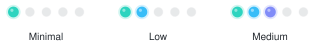

<!--
  GitHub Profile README — Iván Alexander Velasco Sánchez
  Identity: modern developer landing × cybersecurity × applied AI
  Scale for skills is 5 dots; the highest shown is 3/5 (Medium). Never fills.

  TOOLS
  • Local SVG (./assets)     gradient skill dots + banner (GitHub strips inline SVG)
  • skillicons.dev           technology wall
  • shields.io               compact badges / contact / portfolio
  • readme-typing-svg        hero roles
  • github-readme-stats      stats + langs + pin via shion.dev (official vercel.app is often paused)
  • <picture>                light / dark

  CUSTOMIZE
  • Skills: copy a <td> in Skill Levels; change the dots-*-{dark,light}.svg
            minimal = 1  ·  low = 2  ·  medium = 3
  • Tech wall: edit ?i= in skillicons URLs
  • Project: duplicate the Featured table row (template at the bottom of that section)
  • Links: uncomment LinkedIn / Email in Contact when you have real URLs
  • Roles: edit ?lines= in the typing SVG
-->

<picture>
  <source media="(prefers-color-scheme: dark)" srcset="./assets/banner-dark.svg">
  
</picture>

<h1>Iván Alexander Velasco Sánchez</h1>

<picture>
  <source media="(prefers-color-scheme: dark)" srcset="https://readme-typing-svg.demolab.com?font=Fira+Code&weight=600&size=18&duration=2400&pause=1200&color=22D3EE&center=true&vCenter=true&width=560&height=36&lines=Systems+Engineer+%C2%B7+Software+Developer;Cybersecurity+%C2%B7+Applied+AI;Building+intelligent+security+systems">
  
</picture>

<strong>Systems Engineering student</strong> building practical systems where software, security, and AI meet.

  
  &nbsp;
  
  <!--  -->
  <!--  -->

---

## Focus

Building technology solutions at the intersection of **software engineering**, **cybersecurity**, and **applied AI**.

I design and implement research-driven projects — from web systems to static malware analysis — and use AI to accelerate research, prototyping, and review without replacing engineering judgment.

---

## Featured

### 🛡️ [ShadowNet Defender](https://github.com/IVAINX18/Shadow-Net-Defender-Hybrid-Malware-Detection)
*Flagship · Cybersecurity × Machine Learning*

Static malware detection for Windows PE binaries. A **2,381-d** feature pipeline, **DNN / ONNX** inference, and layered heuristics (YARA, PE, .NET, overlays) with local LLM explanations via **Ollama**.

  
  &nbsp;
  
  
  
  

<!-- To add more projects, just add another section block like the one above -->

 

 
Selected work, research, and additional projects live on the portfolio — not duplicated here.

---

## Stack

  
  
  
  
  
  
  
  
  
  
  
  
  
  
  
  
    
  
  
  
  
  
  
  
  

---

## Skill Levels

Working proficiency — honest and conservative. The scale has **five** points; **three** is the current ceiling. Nothing here means expert.

  <picture>
    <source media="(prefers-color-scheme: dark)" srcset="./assets/skills/legend-dark.svg">
    
  </picture>
   
  
    <b>Minimal</b> — initial contact&nbsp;&nbsp;·&nbsp;&nbsp;
    <b>Low</b> — can use on small tasks&nbsp;&nbsp;·&nbsp;&nbsp;
    <b>Medium</b> — practical project experience, still deepening
  

 

<!-- To add a skill, simply append it to the relevant section with its corresponding SVG level -->

<h3 align="center">Software Development</h3>

  <b>Java</b> <picture><source media="(prefers-color-scheme: dark)" srcset="./assets/skills/dots-low-dark.svg"></picture> &nbsp;&nbsp;•&nbsp;&nbsp;
  <b>Python</b> <picture><source media="(prefers-color-scheme: dark)" srcset="./assets/skills/dots-medium-dark.svg"></picture> &nbsp;&nbsp;•&nbsp;&nbsp;
  <b>JavaScript</b> <picture><source media="(prefers-color-scheme: dark)" srcset="./assets/skills/dots-low-dark.svg"></picture> &nbsp;&nbsp;•&nbsp;&nbsp;
  <b>TypeScript</b> <picture><source media="(prefers-color-scheme: dark)" srcset="./assets/skills/dots-minimal-dark.svg"></picture> &nbsp;&nbsp;•&nbsp;&nbsp;
  <b>React</b> <picture><source media="(prefers-color-scheme: dark)" srcset="./assets/skills/dots-minimal-dark.svg"></picture> &nbsp;&nbsp;•&nbsp;&nbsp;
  <b>HTML5</b> <picture><source media="(prefers-color-scheme: dark)" srcset="./assets/skills/dots-low-dark.svg"></picture> &nbsp;&nbsp;•&nbsp;&nbsp;
  <b>CSS3</b> <picture><source media="(prefers-color-scheme: dark)" srcset="./assets/skills/dots-low-dark.svg"></picture> &nbsp;&nbsp;•&nbsp;&nbsp;
  <b>PHP</b> <picture><source media="(prefers-color-scheme: dark)" srcset="./assets/skills/dots-minimal-dark.svg"></picture> &nbsp;&nbsp;•&nbsp;&nbsp;
  <b>SQL</b> <picture><source media="(prefers-color-scheme: dark)" srcset="./assets/skills/dots-minimal-dark.svg"></picture>

<h3 align="center">AI / Machine Learning</h3>

  <b>Machine Learning</b> <picture><source media="(prefers-color-scheme: dark)" srcset="./assets/skills/dots-medium-dark.svg"></picture> &nbsp;&nbsp;•&nbsp;&nbsp;
  <b>Generative AI</b> <picture><source media="(prefers-color-scheme: dark)" srcset="./assets/skills/dots-low-dark.svg"></picture> &nbsp;&nbsp;•&nbsp;&nbsp;
  <b>LLM APIs</b> <picture><source media="(prefers-color-scheme: dark)" srcset="./assets/skills/dots-low-dark.svg"></picture> &nbsp;&nbsp;•&nbsp;&nbsp;
  <b>Prompt Engineering</b> <picture><source media="(prefers-color-scheme: dark)" srcset="./assets/skills/dots-low-dark.svg"></picture> &nbsp;&nbsp;•&nbsp;&nbsp;
  <b>Ollama</b> <picture><source media="(prefers-color-scheme: dark)" srcset="./assets/skills/dots-low-dark.svg"></picture> &nbsp;&nbsp;•&nbsp;&nbsp;
  <b>OpenAI APIs</b> <picture><source media="(prefers-color-scheme: dark)" srcset="./assets/skills/dots-minimal-dark.svg"></picture> &nbsp;&nbsp;•&nbsp;&nbsp;
  <b>Anthropic APIs</b> <picture><source media="(prefers-color-scheme: dark)" srcset="./assets/skills/dots-minimal-dark.svg"></picture>

<h3 align="center">Cybersecurity</h3>

  <b>Malware Detection</b> <picture><source media="(prefers-color-scheme: dark)" srcset="./assets/skills/dots-medium-dark.svg"></picture> &nbsp;&nbsp;•&nbsp;&nbsp;
  <b>Static Analysis</b> <picture><source media="(prefers-color-scheme: dark)" srcset="./assets/skills/dots-medium-dark.svg"></picture> &nbsp;&nbsp;•&nbsp;&nbsp;
  <b>PE Analysis</b> <picture><source media="(prefers-color-scheme: dark)" srcset="./assets/skills/dots-low-dark.svg"></picture> &nbsp;&nbsp;•&nbsp;&nbsp;
  <b>YARA</b> <picture><source media="(prefers-color-scheme: dark)" srcset="./assets/skills/dots-low-dark.svg"></picture> &nbsp;&nbsp;•&nbsp;&nbsp;
  <b>Information Security</b> <picture><source media="(prefers-color-scheme: dark)" srcset="./assets/skills/dots-low-dark.svg"></picture> &nbsp;&nbsp;•&nbsp;&nbsp;
  <b>Security Best Practices</b> <picture><source media="(prefers-color-scheme: dark)" srcset="./assets/skills/dots-low-dark.svg"></picture>

<h3 align="center">Backend / Data</h3>

  <b>FastAPI</b> <picture><source media="(prefers-color-scheme: dark)" srcset="./assets/skills/dots-minimal-dark.svg"></picture> &nbsp;&nbsp;•&nbsp;&nbsp;
  <b>Django</b> <picture><source media="(prefers-color-scheme: dark)" srcset="./assets/skills/dots-minimal-dark.svg"></picture> &nbsp;&nbsp;•&nbsp;&nbsp;
  <b>MySQL</b> <picture><source media="(prefers-color-scheme: dark)" srcset="./assets/skills/dots-low-dark.svg"></picture> &nbsp;&nbsp;•&nbsp;&nbsp;
  <b>PostgreSQL</b> <picture><source media="(prefers-color-scheme: dark)" srcset="./assets/skills/dots-minimal-dark.svg"></picture> &nbsp;&nbsp;•&nbsp;&nbsp;
  <b>SQL</b> <picture><source media="(prefers-color-scheme: dark)" srcset="./assets/skills/dots-minimal-dark.svg"></picture> &nbsp;&nbsp;•&nbsp;&nbsp;
  <b>Relational Modeling</b> <picture><source media="(prefers-color-scheme: dark)" srcset="./assets/skills/dots-minimal-dark.svg"></picture>

<h3 align="center">Infrastructure</h3>

  <b>Linux</b> <picture><source media="(prefers-color-scheme: dark)" srcset="./assets/skills/dots-low-dark.svg"></picture> &nbsp;&nbsp;•&nbsp;&nbsp;
  <b>Windows Server</b> <picture><source media="(prefers-color-scheme: dark)" srcset="./assets/skills/dots-minimal-dark.svg"></picture> &nbsp;&nbsp;•&nbsp;&nbsp;
  <b>Git</b> <picture><source media="(prefers-color-scheme: dark)" srcset="./assets/skills/dots-low-dark.svg"></picture> &nbsp;&nbsp;•&nbsp;&nbsp;
  <b>GitHub</b> <picture><source media="(prefers-color-scheme: dark)" srcset="./assets/skills/dots-low-dark.svg"></picture> &nbsp;&nbsp;•&nbsp;&nbsp;
  <b>TCP/IP</b> <picture><source media="(prefers-color-scheme: dark)" srcset="./assets/skills/dots-minimal-dark.svg"></picture> &nbsp;&nbsp;•&nbsp;&nbsp;
  <b>DNS</b> <picture><source media="(prefers-color-scheme: dark)" srcset="./assets/skills/dots-minimal-dark.svg"></picture> &nbsp;&nbsp;•&nbsp;&nbsp;
  <b>Virtualization</b> <picture><source media="(prefers-color-scheme: dark)" srcset="./assets/skills/dots-minimal-dark.svg"></picture>

<h3 align="center">Tools</h3>

  <b>VS Code</b> <picture><source media="(prefers-color-scheme: dark)" srcset="./assets/skills/dots-low-dark.svg"></picture> &nbsp;&nbsp;•&nbsp;&nbsp;
  <b>Cursor</b> <picture><source media="(prefers-color-scheme: dark)" srcset="./assets/skills/dots-low-dark.svg"></picture> &nbsp;&nbsp;•&nbsp;&nbsp;
  <b>Eclipse</b> <picture><source media="(prefers-color-scheme: dark)" srcset="./assets/skills/dots-minimal-dark.svg"></picture> &nbsp;&nbsp;•&nbsp;&nbsp;
  <b>Figma</b> <picture><source media="(prefers-color-scheme: dark)" srcset="./assets/skills/dots-minimal-dark.svg"></picture> &nbsp;&nbsp;•&nbsp;&nbsp;
  <b>Power BI</b> <picture><source media="(prefers-color-scheme: dark)" srcset="./assets/skills/dots-minimal-dark.svg"></picture> &nbsp;&nbsp;•&nbsp;&nbsp;
  <b>n8n</b> <picture><source media="(prefers-color-scheme: dark)" srcset="./assets/skills/dots-minimal-dark.svg"></picture>

---

## AI-assisted engineering

AI supports the workflow. Architecture, security, and final decisions stay human.

Research · Prototyping · Problem solving · Code review · Automation · Documentation

  

---

## Research

Cybersecurity · Malware Detection · Artificial Intelligence · Machine Learning 
Data Science · Software Engineering · Intelligent Systems · Automation

---

## GitHub

<!-- Stats + languages only. Streak/trophies/snake omitted: extra noise, weaker signal. -->

  <picture>
    <source media="(prefers-color-scheme: dark)" srcset="https://github-readme-stats.shion.dev/api?username=IVAINX18&show_icons=true&theme=transparent&hide_border=true&title_color=22D3EE&icon_color=818CF8&text_color=C9D1D9&hide=issues">
    
  </picture>
  <picture>
    <source media="(prefers-color-scheme: dark)" srcset="https://github-readme-stats.shion.dev/api/top-langs/?username=IVAINX18&layout=compact&theme=transparent&hide_border=true&title_color=22D3EE&text_color=C9D1D9">
    
  </picture>

---

## Contact

&nbsp;

<!--  -->
<!--  -->

<picture>
  <source media="(prefers-color-scheme: dark)" srcset="./assets/banner-dark.svg">
  
</picture>
