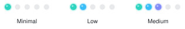

<picture>
  <source media="(prefers-color-scheme: dark)" srcset="./assets/banner-dark.svg">
  
</picture>

<div align="center">

<h1>Iván Alexander Velasco Sánchez</h1>

<picture>
  <source media="(prefers-color-scheme: dark)" srcset="https://readme-typing-svg.demolab.com?font=Fira+Code&weight=600&size=18&duration=2400&pause=1200&color=22D3EE&center=true&vCenter=true&width=560&height=36&lines=Systems+Engineer+%C2%B7+Software+Developer;Cybersecurity+%C2%B7+Applied+AI;Building+intelligent+security+systems">
  
</picture>

<p><strong>Systems Engineering student</strong> building practical systems where software, security, and AI meet.</p>

<p>
  <a href="https://portafolioivanvelasco.vercel.app/"></a>
  &nbsp;
  <a href="https://www.linkedin.com/in/ivan-velasco-660a512bb/"></a>
  &nbsp;
  <a href="mailto:ivanvelascosanchez74@gmail.com"></a>
  &nbsp;
  <a href="https://github.com/IVAINX18"></a>
</p>

<p>
  
  <a href="https://orcid.org/0009-0000-3300-3724"></a>
  
</p>

<p>
  
  
  
</p>

</div>

---

## About

I am a Systems Engineering student with a solid foundation in programming tools, AI and cybersecurity, specializing in Web Development with a strong interest in information security and data analysis. My goal is to grow as a developer and contribute to secure, innovative technological solutions — combining technical expertise with creative problem-solving.

I work across software engineering, AI/ML and full-stack development with a product engineering mindset: research-driven, security-conscious, and focused on shipping systems that work in practice. AI supports my workflow — research, prototyping, review — while architecture, security and final decisions stay human.

**Open To:** software engineering internships · cybersecurity & AI research collaborations · open-source collaboration.

---

## Tech Stack

<div align="center">

**Languages**


**Frontend**


**Backend & Databases**


**Cloud, DevOps & Tooling**


</div>

---

## Skill Levels

Working proficiency — honest and conservative. The scale has **five** points; **three** is the current ceiling. Nothing here means expert.

<div align="center">
  <picture>
    <source media="(prefers-color-scheme: dark)" srcset="./assets/skills/legend-dark.svg">
    
  </picture>
  <br/>
  <sub>
    <b>Minimal</b> — initial contact&nbsp;&nbsp;·&nbsp;&nbsp;
    <b>Low</b> — can use on small tasks&nbsp;&nbsp;·&nbsp;&nbsp;
    <b>Medium</b> — practical project experience, still deepening
  </sub>
</div>

<br/>

<div align="center">

<details>
  <summary><b>Software Development</b></summary>
  <br/>
  <p align="center">
    <b>Java</b> <picture><source media="(prefers-color-scheme: dark)" srcset="./assets/skills/dots-low-dark.svg"></picture> &nbsp;&nbsp;•&nbsp;&nbsp;
    <b>Python</b> <picture><source media="(prefers-color-scheme: dark)" srcset="./assets/skills/dots-medium-dark.svg"></picture> &nbsp;&nbsp;•&nbsp;&nbsp;
    <b>JavaScript</b> <picture><source media="(prefers-color-scheme: dark)" srcset="./assets/skills/dots-low-dark.svg"></picture> &nbsp;&nbsp;•&nbsp;&nbsp;
    <b>TypeScript</b> <picture><source media="(prefers-color-scheme: dark)" srcset="./assets/skills/dots-minimal-dark.svg"></picture> &nbsp;&nbsp;•&nbsp;&nbsp;
    <b>React</b> <picture><source media="(prefers-color-scheme: dark)" srcset="./assets/skills/dots-minimal-dark.svg"></picture> &nbsp;&nbsp;•&nbsp;&nbsp;
    <b>HTML5</b> <picture><source media="(prefers-color-scheme: dark)" srcset="./assets/skills/dots-low-dark.svg"></picture> &nbsp;&nbsp;•&nbsp;&nbsp;
    <b>CSS3</b> <picture><source media="(prefers-color-scheme: dark)" srcset="./assets/skills/dots-low-dark.svg"></picture> &nbsp;&nbsp;•&nbsp;&nbsp;
    <b>PHP</b> <picture><source media="(prefers-color-scheme: dark)" srcset="./assets/skills/dots-minimal-dark.svg"></picture> &nbsp;&nbsp;•&nbsp;&nbsp;
    <b>SQL</b> <picture><source media="(prefers-color-scheme: dark)" srcset="./assets/skills/dots-minimal-dark.svg"></picture>
  </p>
</details>

<br/>

<details>
  <summary><b>AI / Machine Learning</b></summary>
  <br/>
  <p align="center">
    <b>Machine Learning</b> <picture><source media="(prefers-color-scheme: dark)" srcset="./assets/skills/dots-medium-dark.svg"></picture> &nbsp;&nbsp;•&nbsp;&nbsp;
    <b>Generative AI</b> <picture><source media="(prefers-color-scheme: dark)" srcset="./assets/skills/dots-low-dark.svg"></picture> &nbsp;&nbsp;•&nbsp;&nbsp;
    <b>LLM APIs</b> <picture><source media="(prefers-color-scheme: dark)" srcset="./assets/skills/dots-low-dark.svg"></picture> &nbsp;&nbsp;•&nbsp;&nbsp;
    <b>Prompt Engineering</b> <picture><source media="(prefers-color-scheme: dark)" srcset="./assets/skills/dots-low-dark.svg"></picture> &nbsp;&nbsp;•&nbsp;&nbsp;
    <b>Ollama</b> <picture><source media="(prefers-color-scheme: dark)" srcset="./assets/skills/dots-low-dark.svg"></picture> &nbsp;&nbsp;•&nbsp;&nbsp;
    <b>OpenAI APIs</b> <picture><source media="(prefers-color-scheme: dark)" srcset="./assets/skills/dots-minimal-dark.svg"></picture> &nbsp;&nbsp;•&nbsp;&nbsp;
    <b>Anthropic APIs</b> <picture><source media="(prefers-color-scheme: dark)" srcset="./assets/skills/dots-minimal-dark.svg"></picture>
  </p>
</details>

<br/>

<details>
  <summary><b>Cybersecurity</b></summary>
  <br/>
  <p align="center">
    <b>Malware Detection</b> <picture><source media="(prefers-color-scheme: dark)" srcset="./assets/skills/dots-medium-dark.svg"></picture> &nbsp;&nbsp;•&nbsp;&nbsp;
    <b>Static Analysis</b> <picture><source media="(prefers-color-scheme: dark)" srcset="./assets/skills/dots-medium-dark.svg"></picture> &nbsp;&nbsp;•&nbsp;&nbsp;
    <b>PE Analysis</b> <picture><source media="(prefers-color-scheme: dark)" srcset="./assets/skills/dots-low-dark.svg"></picture> &nbsp;&nbsp;•&nbsp;&nbsp;
    <b>YARA</b> <picture><source media="(prefers-color-scheme: dark)" srcset="./assets/skills/dots-low-dark.svg"></picture> &nbsp;&nbsp;•&nbsp;&nbsp;
    <b>Information Security</b> <picture><source media="(prefers-color-scheme: dark)" srcset="./assets/skills/dots-low-dark.svg"></picture> &nbsp;&nbsp;•&nbsp;&nbsp;
    <b>Security Best Practices</b> <picture><source media="(prefers-color-scheme: dark)" srcset="./assets/skills/dots-low-dark.svg"></picture>
  </p>
</details>

<br/>

<details>
  <summary><b>Backend / Data</b></summary>
  <br/>
  <p align="center">
    <b>FastAPI</b> <picture><source media="(prefers-color-scheme: dark)" srcset="./assets/skills/dots-minimal-dark.svg"></picture> &nbsp;&nbsp;•&nbsp;&nbsp;
    <b>Django</b> <picture><source media="(prefers-color-scheme: dark)" srcset="./assets/skills/dots-minimal-dark.svg"></picture> &nbsp;&nbsp;•&nbsp;&nbsp;
    <b>MySQL</b> <picture><source media="(prefers-color-scheme: dark)" srcset="./assets/skills/dots-low-dark.svg"></picture> &nbsp;&nbsp;•&nbsp;&nbsp;
    <b>PostgreSQL</b> <picture><source media="(prefers-color-scheme: dark)" srcset="./assets/skills/dots-minimal-dark.svg"></picture> &nbsp;&nbsp;•&nbsp;&nbsp;
    <b>SQL</b> <picture><source media="(prefers-color-scheme: dark)" srcset="./assets/skills/dots-minimal-dark.svg"></picture> &nbsp;&nbsp;•&nbsp;&nbsp;
    <b>Relational Modeling</b> <picture><source media="(prefers-color-scheme: dark)" srcset="./assets/skills/dots-minimal-dark.svg"></picture>
  </p>
</details>

<br/>

<details>
  <summary><b>Infrastructure</b></summary>
  <br/>
  <p align="center">
    <b>Linux</b> <picture><source media="(prefers-color-scheme: dark)" srcset="./assets/skills/dots-low-dark.svg"></picture> &nbsp;&nbsp;•&nbsp;&nbsp;
    <b>Windows Server</b> <picture><source media="(prefers-color-scheme: dark)" srcset="./assets/skills/dots-minimal-dark.svg"></picture> &nbsp;&nbsp;•&nbsp;&nbsp;
    <b>Git</b> <picture><source media="(prefers-color-scheme: dark)" srcset="./assets/skills/dots-low-dark.svg"></picture> &nbsp;&nbsp;•&nbsp;&nbsp;
    <b>GitHub</b> <picture><source media="(prefers-color-scheme: dark)" srcset="./assets/skills/dots-low-dark.svg"></picture> &nbsp;&nbsp;•&nbsp;&nbsp;
    <b>TCP/IP</b> <picture><source media="(prefers-color-scheme: dark)" srcset="./assets/skills/dots-minimal-dark.svg"></picture> &nbsp;&nbsp;•&nbsp;&nbsp;
    <b>DNS</b> <picture><source media="(prefers-color-scheme: dark)" srcset="./assets/skills/dots-minimal-dark.svg"></picture> &nbsp;&nbsp;•&nbsp;&nbsp;
    <b>Virtualization</b> <picture><source media="(prefers-color-scheme: dark)" srcset="./assets/skills/dots-minimal-dark.svg"></picture>
  </p>
</details>

<br/>

<details>
  <summary><b>Tools</b></summary>
  <br/>
  <p align="center">
    <b>VS Code</b> <picture><source media="(prefers-color-scheme: dark)" srcset="./assets/skills/dots-low-dark.svg"></picture> &nbsp;&nbsp;•&nbsp;&nbsp;
    <b>Cursor</b> <picture><source media="(prefers-color-scheme: dark)" srcset="./assets/skills/dots-low-dark.svg"></picture> &nbsp;&nbsp;•&nbsp;&nbsp;
    <b>Eclipse</b> <picture><source media="(prefers-color-scheme: dark)" srcset="./assets/skills/dots-minimal-dark.svg"></picture> &nbsp;&nbsp;•&nbsp;&nbsp;
    <b>Figma</b> <picture><source media="(prefers-color-scheme: dark)" srcset="./assets/skills/dots-minimal-dark.svg"></picture> &nbsp;&nbsp;•&nbsp;&nbsp;
    <b>Power BI</b> <picture><source media="(prefers-color-scheme: dark)" srcset="./assets/skills/dots-minimal-dark.svg"></picture> &nbsp;&nbsp;•&nbsp;&nbsp;
    <b>n8n</b> <picture><source media="(prefers-color-scheme: dark)" srcset="./assets/skills/dots-minimal-dark.svg"></picture>
  </p>
</details>

</div>

---

## AI / ML Expertise

| Domain | Proficiency | Details |
| ------ | ----------- | ------- |
| Machine Learning & Deep Learning | Intermediate | PyTorch, scikit-learn; deep neural networks trained on EMBER and SOREL-20M for malware detection |
| Applied AI for Cybersecurity | Intermediate | Hybrid ML + heuristic detection pipelines; static PE analysis at scale |
| Model Deployment & Inference | Intermediate | ONNX Runtime production inference; integration of trained models into real systems |
| Generative AI & LLM Integration | Familiar | Local models with Ollama; LLM-assisted explanations; OpenAI and Anthropic APIs |
| Data Science & Analysis | Familiar | NumPy, SHAP; exploratory analysis and feature engineering |
| AI-Assisted Development | Familiar | AI-accelerated research, prototyping and code review with Cursor, ChatGPT and Claude |

---

## Featured Projects

<details>
<summary><b>🛡️ ShadowNet Defender</b> — intelligent malware detection with deep learning</summary>
<br/>

Static malware detection for Windows PE binaries — a 2,381-d feature pipeline, DNN/ONNX inference, layered heuristics (YARA, PE, .NET, overlays) and local LLM explanations via Ollama.

<p>
  <a href="https://github.com/IVAINX18/Shadow-Net-Defender-Hybrid-Malware-Detection"></a>
  &nbsp;
  
  
  
  
</p>

| | |
| --- | --- |
| Stack | Python · PyTorch · ONNX Runtime · YARA · Ollama · Java |
| Scale | 2,381-dimensional feature pipeline; trained on large-scale datasets (EMBER, SOREL-20M) |
| Performance | 98.15% accuracy · 1.2% false positives · 0.65% false negatives (published IEEE results) |
| Security | Layered static analysis — PE parsing, YARA rules, .NET inspection, overlay detection — with human-readable local LLM explanations |
| Impact | Published at IEEE Xplore (Doc. 11214618) — intelligent malware detection system |
| Repository | https://github.com/IVAINX18/Shadow-Net-Defender-Hybrid-Malware-Detection |

A research-grade detection system that combines deep learning with classical static analysis: the neural model handles large-scale classification while layered heuristics catch structural anomalies, and every verdict is explained in plain language by a local LLM — no cloud dependency, no data leaving the machine.

</details>

<details>
<summary><b>🔒 Secure Call</b> — real-time secure video calling</summary>
<br/>

Real-time video-calling application built with React, Vite, PeerJS and WebRTC; secure peer-to-peer audio/video through a lightweight client-server architecture with a dedicated Express + Socket.IO signaling server.

<p>
  <a href="https://github.com/IVAINX18/Secure-Call"></a>
  &nbsp;
  
  
  
  
</p>

| | |
| --- | --- |
| Stack | React · Vite · PeerJS · WebRTC · Express · Socket.IO · Tailwind CSS |
| Scale | Peer-to-peer media — streams flow directly between peers; server only for signaling |
| Performance | Direct P2P audio/video with minimal server load |
| Security | Standards-based WebRTC media encryption; isolated signaling layer |
| Impact | End-to-end secure communication tool shipped and documented |
| Repository | https://github.com/IVAINX18/Secure-Call |

A full-stack real-time communication project demonstrating modern frontend engineering and network architecture: the client handles media and UI while a minimal signaling server coordinates sessions — keeping the media path direct, private and efficient.

</details>

<details>
<summary><b>Hotel Website</b> — multi-page hotel site, TalentoTECH capstone</summary>
<br/>

Multi-page hotel website built for the TalentoTECH bootcamp — landing, booking, reservation management and inventory pages with gallery and responsive layout.

<p>
  <a href="https://github.com/IVAINX18/Pagina-de-Hotel"></a>
  
  
  
  <a href="https://ivainx18.github.io/Pagina-de-Hotel/"></a>
</p>

| | |
| --- | --- |
| Stack | HTML · CSS · JavaScript · PHP |
| Scale | Multi-page site (landing, booking, reservations, inventory) |
| Performance | Responsive layout across devices |
| Security | Baseline input handling and standard web practices |
| Impact | Bootcamp capstone project |
| Repository | https://github.com/IVAINX18/Pagina-de-Hotel |

A complete bootcamp capstone covering the full lifecycle of a small web product: multiple content pages, booking flows, reservation and inventory management, and a responsive gallery — from markup to deployment.

</details>

<details>
<summary><b>BMI Calculator</b> — interactive health utility</summary>
<br/>

Interactive Body Mass Index calculator with input validation, visual feedback and health recommendations.

<p>
  <a href="https://github.com/IVAINX18/Calculadora_IMC"></a>
  
  
  <a href="https://ivainx18.github.io/Calculadora_IMC/"></a>
</p>

| | |
| --- | --- |
| Stack | HTML · CSS · JavaScript |
| Scale | Single-page interactive utility |
| Performance | Instant client-side computation, zero dependencies |
| Security | Client-side input validation |
| Impact | Early foundations project — clean UX fundamentals |
| Repository | https://github.com/IVAINX18/Calculadora_IMC |

A focused foundations project built around one interaction done well: validated inputs, instant feedback and clear health guidance — demonstrating clean vanilla JavaScript and UX fundamentals without any framework overhead.

</details>

---

## Experience

**Systems Engineering Student** — Universidad Cooperativa de Colombia · Feb 2022 – Present

Undergraduate program covering software engineering, networks, databases and information systems.

- Coursework across software development, networking fundamentals and database design
- Applied academic foundations in research and personal projects

`Java` `SQL` `Networking` `Software Engineering` `Databases`

**Independent Developer & Researcher** — Self-directed · 2024 – Present

Research-driven projects across software engineering, cybersecurity and applied AI.

- Built ShadowNet Defender, published at IEEE Xplore
- Developed Secure Call, a real-time P2P video-calling application
- Maintains a live portfolio documenting selected work and research

`Python` `PyTorch` `ONNX` `React` `Security Research`

---

## Achievements

| Recognition | Details |
| ----------- | ------- |
| IEEE Xplore Publication | "ShadowNet Defender: Development of an Intelligent System for Malware Detection Based on Deep Learning" (2025) — https://ieeexplore.ieee.org/document/11214618 |
| ORCID iD | 0009-0000-3300-3724 — research identity |
| GitHub Pull Shark ×2 | Multiple merged pull requests |
| TalentoTECH Bootcamp | Completed programming bootcamp (2024) |

---

## GitHub Analytics

<div align="center">
  <picture>
    <source media="(prefers-color-scheme: dark)" srcset="https://github-readme-stats.shion.dev/api?username=IVAINX18&show_icons=true&theme=transparent&hide_border=true&title_color=818CF8&icon_color=8B5CF6&text_color=C9D1D9&hide=issues">
    
  </picture>
  <picture>
    <source media="(prefers-color-scheme: dark)" srcset="https://github-readme-stats.shion.dev/api/top-langs/?username=IVAINX18&layout=compact&theme=transparent&hide_border=true&title_color=818CF8&text_color=C9D1D9">
    
  </picture>
  <br/>
  
</div>

---

## GitHub Trophies

<div align="center">
  
  
  
  
</div>

---

## Contribution Activity

<div align="center">
  
</div>

---

## Contribution Snake

<div align="center">
<picture>
  <source media="(prefers-color-scheme: dark)" srcset="https://raw.githubusercontent.com/IVAINX18/IVAINX18/output/github-snake-dark.svg">
  
</picture>
</div>

---

## Current Focus

```yaml
learning:
  - Advanced malware analysis and reverse engineering
  - Deep learning optimization (ONNX)
  - Cloud and DevOps fundamentals
building:
  - ShadowNet Defender — detection pipeline
  - Secure communication tools
  - Research portfolio
exploring:
  - Applied AI for cybersecurity
  - Data science and analytics
  - Open-source contributions
open_to:
  - Software engineering internships
  - Cybersecurity and AI research collaborations
```

---

## Connect

<div align="center">
  <a href="mailto:ivanvelascosanchez74@gmail.com"></a>
  &nbsp;
  <a href="https://www.linkedin.com/in/ivan-velasco-660a512bb/"></a>
  &nbsp;
  <a href="https://github.com/IVAINX18"></a>
  &nbsp;
  <a href="https://portafolioivanvelasco.vercel.app/"></a>
</div>

---

## Footer

<div align="center">

*"Security is a process, not a product."* — Bruce Schneier

</div>

<picture>
  <source media="(prefers-color-scheme: dark)" srcset="./assets/banner-dark.svg">
  
</picture>


